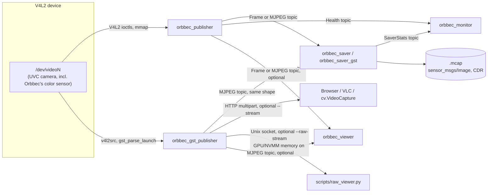
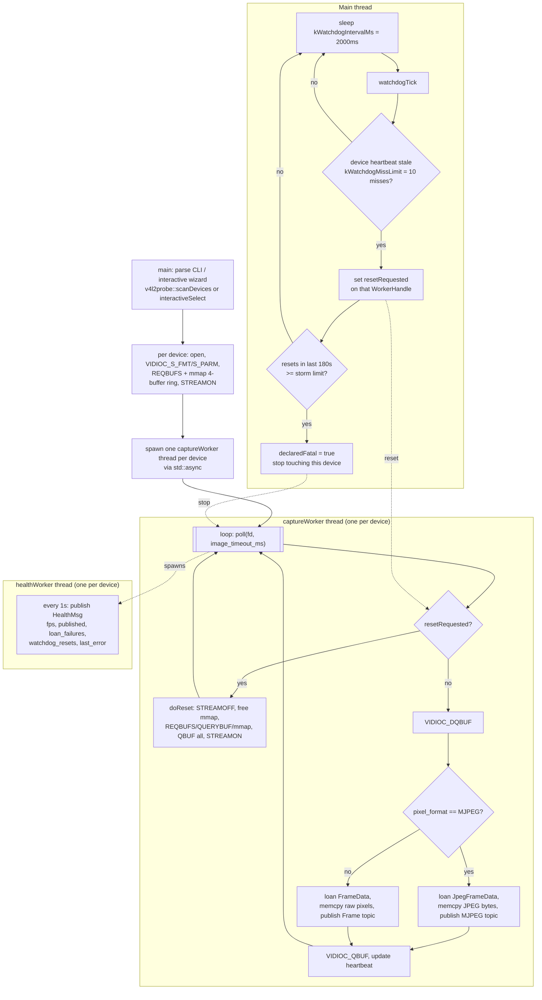
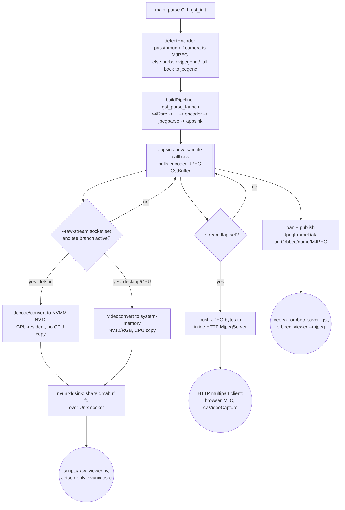

# Design

## System Architecture

V4L2/UVC camera capture, published over Eclipse Iceoryx shared memory. There are two independent publish paths that both feed the same recorder/monitor/viewer tooling:

- **Plain path** — `orbbec_publisher` reads V4L2 directly.
- **GStreamer path** — `orbbec_gst_publisher` runs capture through a GStreamer pipeline, adding hardware JPEG encoding and optional HTTP/raw-socket outputs.



A few things worth knowing about this diagram:
- Each publisher opens its **own** V4L2 device handle. They don't share a capture, and most drivers won't let both publishers use the camera at once.
- Both publishers can produce the **same** iceoryx `Orbbec/<name>/MJPEG` topic shape (`orbbec::JpegFrameData`), so `orbbec_saver_gst` and `orbbec_viewer` work with either one interchangeably.

### Iceoryx topics

| Service | Instance | Event | Message type | Published by | Subscribed by |
|---|---|---|---|---|---|
| `Orbbec` | `<name>` | `Frame` | `orbbec::FrameData` (untyped, raw V4L2 pixels) | `orbbec_publisher` (non-MJPEG mode), `orbbec_mock_publisher` | `orbbec_saver`, `orbbec_viewer` |
| `Orbbec` | `<name>` | `MJPEG` | `orbbec::JpegFrameData` (untyped, JPEG) | `orbbec_publisher` (MJPEG passthrough), `orbbec_gst_publisher` | `orbbec_saver_gst`, `orbbec_viewer` |
| `Orbbec` | `<name>` | `Health` | `orbbec::HealthMsg` (typed, 1 Hz) | `orbbec_publisher` only | `orbbec_monitor` |
| `Orbbec` | `<name>` | `SaverStats` | `orbbec::SaverStatsMsg` (typed, 1 Hz) | `orbbec_saver` only | `orbbec_monitor` |

Note the gaps: `orbbec_gst_publisher` has no watchdog and doesn't publish `Health`. `orbbec_saver_gst` doesn't publish `SaverStats`. `orbbec_monitor` will simply show nothing for those.

## Individual Nodes

### ORBBEC_PUBLISHER — main node, plain V4L2 pipeline

Source: `src/orbbec_publisher.cpp`. Captures from one or more V4L2 devices and publishes frames on Iceoryx, in either raw or MJPEG-passthrough mode. Uses the same watchdog architecture as `mm_batch_publisher` and `lucid_publisher` in the sibling repos.

```bash
orbbec_publisher [OPTIONS]
  --serial <s1,s2,...>     match cameras by USB serial (resolved via v4l2probe::scanDevices())
  --device <path> <name>   capture from this V4L2 device (repeatable)
  --format <fmt>           MJPEG, YUYV, NV12 (default: MJPEG)
  --width  <px>
  --height <px>
  --list-formats           print supported formats per device and exit (no RouDi needed)
  --config <path>          YAML config (default: config/orbbec_publisher.yaml)
```

A few notes on usage:
- With `--serial`, the iceoryx instance name is the serial number itself.
- Run it with no args at all and it drops into an interactive wizard (`v4l2probe::interactiveSelect`) to pick a device/format/resolution/fps.
- `--list-formats` works without RouDi running.

**How it talks to the camera.** Plain V4L2, not the Orbbec SDK: `open()`, `xioctl()` for the usual ioctl set (`QUERYCAP`, `ENUM_FMT`, `S_FMT`, `REQBUFS`, `QBUF`/`DQBUF`, `STREAMON`/`STREAMOFF`), an `mmap()`-based zero-copy 4-buffer ring, and `poll()` to wait for frames.

**Threading.**
- One `captureWorker` thread per device (via `std::async`).
- Each `captureWorker` spawns a nested `healthWorker` thread that publishes `HealthMsg` once a second.
- The **main thread** runs the watchdog loop, ticking every `kWatchdogIntervalMs` (2000ms).

**Watchdog behavior.**
1. Miss `kWatchdogMissLimit` (10) heartbeats in a row — about 20s of silence — and `resetRequested` fires.
2. `captureWorker` handles the reset in place: `STREAMOFF` → free the mmap buffers → `REQBUFS`/`QUERYBUF`/`mmap` again → `QBUF` all buffers → `STREAMON`.
3. If a device needs `kResetStormCount` (10) resets within `kResetStormWindowSec` (180s), it's marked `declaredFatal`. Auto-recovery is permanently disabled for that device — but other devices keep running fine.

**Capture loop, per frame:**
1. `poll()` up to `image_timeout_ms` (default 2000ms).
2. `VIDIOC_DQBUF` to pull the buffer.
3. Branch on format:
   - **MJPEG** (camera's native format, passthrough, no re-encode) → loan `JpegFrameData`, `memcpy`, publish.
   - **Raw** (YUYV/NV12/etc.) → loan `FrameData`, `memcpy`, publish.

**Config** (`config/orbbec_publisher.yaml`):
```yaml
devices:
  - path: /dev/video0
    name: cam0
  - path: /dev/video2
    name: cam1
width: 1280
height: 720
fps: 30
pixel_format: YUYV     # YUYV or MJPEG
image_timeout_ms: 2000
queue_capacity: 500
```

**No ROS2 integration.** No `rclcpp`, no ROS2 parameters, no odom/gps/imu subscriptions. The MCAP writer emits `sensor_msgs/msg/Image`-schema CDR bytes purely so the output file is a valid rosbag2/Foxglove file — there's no live ROS2 node running.

### ORBBEC_GST_PUBLISHER — GStreamer pipeline

Source: `src/orbbec_gst_publisher.cpp`. Only built if GStreamer ≥1.18 is found at configure time — it may not exist as a binary on every build. Opens its own V4L2 device, independent of `orbbec_publisher`, and runs capture through a `gst_parse_launch()` pipeline instead of raw ioctls.

**Encoder selection.**
- If the camera is already MJPEG: passthrough, no re-encode.
- Otherwise, `--jetson`/`--cpu` force a choice, or it auto-probes: try `nvjpegenc` with a real throwaway test pipeline, fall back to CPU `jpegenc` if that doesn't work.

**Pipeline shapes** (`buildPipeline()`):

| Case | Pipeline |
|---|---|
| Passthrough (already MJPEG) | `v4l2src ! image/jpeg,... ! jpegparse ! appsink` |
| Jetson | `... ! videoconvert ! I420 ! nvvidconv ! NVMM I420 ! nvjpegenc ! jpegparse ! appsink` |
| Desktop NVIDIA | `... ! videoconvert ! I420 ! nvjpegenc ! jpegparse ! appsink` |
| CPU | `... ! videoconvert ! I420 ! jpegenc ! jpegparse ! appsink` |

Any of these can also `tee` off a raw Unix-socket branch if `--raw-stream` is given.

**`--raw-stream` stays in GPU memory on Jetson — it's zero-copy, not a GPU→CPU copy.**

On Jetson, the raw `tee` branch decodes/converts into `video/x-raw(memory:NVMM)` — GPU/shared DMA memory — before reaching `nvunixfdsink`. That sink hands the consumer a dmabuf file descriptor over the Unix socket, so the frame never touches system RAM. On desktop NVIDIA and CPU builds, the same branch explicitly `videoconvert`s into regular system memory first, so there it *is* a normal CPU copy. `scripts/raw_viewer.py` is the matching Jetson-side consumer — it can read the NVMM buffer back without an extra copy either.

**Outputs:**

| Output | Path | Notes |
|---|---|---|
| Iceoryx | `Orbbec/<name>/MJPEG` | Always on. Same `JpegFrameData` shape as `orbbec_publisher`'s MJPEG mode. |
| HTTP | `http://<host>:<port>/` | Only with `--stream`. Hand-rolled multipart server (`MjpegServer` class), not a GStreamer HTTP element. |
| Raw socket | `nvunixfdsink` at `--raw-stream <path>` | NV12 in GPU/NVMM memory on Jetson (zero-copy); NV12/RGB in system memory otherwise. Consumed by `scripts/raw_viewer.py`. |

**CLI:** `--device`, `--name` (default `cam0`), `--format`, `--width`(1280)/`--height`(720), `--fps`(30), `--quality`(85), `--port` (default `9000`), `--jetson`, `--cpu`, `--stream`, `--raw-stream <unix-socket-path>`.

**vs. `orbbec_publisher`:** separate process, separate device handle, no shared frames. This path is heavier and more capable — re-encode to MJPEG from any format, optional HTTP preview, optional raw-frame side channel — but it has **no watchdog and no `Health` topic**.

### ORBBEC_SAVER

Source: `src/orbbec_saver.cpp`. Subscribes to one or more devices' `Frame` topic and writes segmented `.mcap` files (`sensor_msgs/msg/Image`, CDR). Also publishes `SaverStats`.

```bash
orbbec_saver [--config <path>] [--name <name> ...]
```

- `--config` defaults to `config/orbbec_saver.yaml`.
- `--name` (repeatable) overrides the config's `devices:` list.
- One `saverWorker` thread per device: subscribes `Orbbec/<name>/Frame`, drains up to 256 samples per loop, writes to `<output_dir>/<name>/<YYYYMMDD_HHMMSS>_seg001.mcap`, and rolls a new segment once `bytes_written() >= segment_size_gib`.
- A separate `saverStatsWorker` thread publishes `SaverStats` once a second.

### ORBBEC_SAVER_GST

Source: `src/orbbec_saver_gst.cpp`. Subscribes to the `MJPEG` topic (from either publisher) and writes segmented `.mcap` files (`foxglove.CompressedImage`, protobuf).

```bash
orbbec_saver_gst [--name <name> ...] [--config <path>] [--out <dir>]
```

Same drain/segment-rollover behavior as `orbbec_saver`. `--out` defaults to `../data/video` or `<output_dir>/video` from config. Writes `<outDir>/<name>/<timestamp>_segNNN.mcap`.

**No stats thread** — unlike `orbbec_saver`, this node never publishes `SaverStats`.

### ORBBEC_MONITOR

Source: `src/orbbec_monitor.cpp`. Terminal dashboard. `--config` (default `config/orbbec_saver.yaml`) is only used to read the `devices:` list. Subscribes `Health` and `SaverStats` per device and redraws every 500ms:

```
Orbbec Camera Monitor                    <wall time>
  cam0  ● OK
    pub  fps=29.9  1280x720
         published=1234  loan_failures=0  resets=0
    sav  fps=29.8  saved=1230  seg=1  seg_size=42 MiB  write=0.10ms  e2e=3.1ms
```

Shows "publisher not seen" / "sav not connected" / red error lines when applicable.

### ORBBEC_VIEWER

Source: `scripts/orbbec_viewer.cpp` — a compiled binary despite living under `scripts/`.

```
--name <name>          default cam0
--mjpeg                subscribe Iceoryx MJPEG instead of raw Frame
--mjpeg-stream         connect to an HTTP MJPEG URL via cv::VideoCapture instead of Iceoryx
--mjpeg-url <url>      default http://localhost:9000/, pairs with orbbec_gst_publisher --stream
```

### ORBBEC_MOCK_PUBLISHER

Source: `src/orbbec_mock_publisher.cpp`.

```bash
./orbbec_mock_publisher <name1> [name2 ...] [--config <path>]
```

Generates synthetic YUYV frames (a repeating `idx % 256` byte pattern, so corruption or drops are visible), one worker thread per name, publishing `Orbbec/<name>/Frame` at config `fps` (default 10). No hardware needed — used to validate `orbbec_saver` + MCAP output in isolation, and is what `scripts/bench_launch.py --mock` drives.

## Detailed Overview

### ORBBEC_PUBLISHER — general flow (plain V4L2 pipeline)



**Threading, summarized:** one main thread runs the watchdog. Each V4L2 device gets its own `captureWorker` thread (own file descriptor, own mmap ring, own `WorkerHandle`) plus a nested `healthWorker` thread. Signaling between threads is atomic-flag-based on the hot path, so a stalled or resetting device never blocks another device's capture loop. Same pattern as `mm_batch_publisher`/`lucid_publisher`.

### ORBBEC_GST_PUBLISHER — general flow (GStreamer pipeline)



No watchdog, no reset-storm logic, no `Health` topic on this path. If `v4l2src` stalls, GStreamer's own bus error/EOS handling is the only recovery signal — there's no automatic reconnect layered on top of it here.

## Data Format

### `FrameData` — `orbbec::FrameData`, `include/orbbec_data.hpp`

A flat, `alignas(64)` struct written directly into the Iceoryx shared-memory chunk. Zero-copy, no serialization.

| Offset | Field | Type | Size | Meaning |
|---|---|---|---|---|
| 0–7 | `timestamp_ns` | `u64` | 8 | system_clock ns since epoch at capture |
| 8–15 | `sequence_number` | `u64` | 8 | monotonically increasing per-camera counter |
| 16–19 | `width` | `u32` | 4 | pixels |
| 20–23 | `height` | `u32` | 4 | pixels |
| 24–27 | `pixel_format` | `u32` | 4 | V4L2 fourcc, e.g. `V4L2_PIX_FMT_YUYV` |
| 28–31 | `_pad` | `u32` | 4 | explicit padding |
| 32–39 | `data_size` | `u64` | 8 | bytes of pixel data |
| 40+ | `data[]` | `u8[]` | `data_size` | raw pixel bytes, native `pixel_format` |

`kHeaderSize = 40`. Total payload = `40 + data_size`.

### `JpegFrameData` — `orbbec::JpegFrameData`, `include/orbbec_data.hpp`

| Offset | Field | Type | Size | Meaning |
|---|---|---|---|---|
| 0–7 | `timestamp_ns` | `u64` | 8 | |
| 8–15 | `sequence_number` | `u64` | 8 | |
| 16–19 | `is_keyframe` | `u32` | 4 | always `1` for MJPEG |
| 20–23 | `data_size` | `u32` | 4 | bytes of encoded JPEG |
| 24+ | `data[]` | `u8[]` | `data_size` | JPEG bytes |

`kJpegHeaderSize = 24`. Total payload = `24 + data_size`.

No point-cloud, depth, IR, or intrinsics struct exists anywhere in this repo.

### `HealthMsg` — `orbbec::HealthMsg`, `include/orbbec_health.hpp` (typed, 1 Hz)

`timestamp_ns`, `frames_published`, `loan_failures`, `actual_fps`, `exposure_time_us` (unused, always 0 — V4L2 exposure control isn't exposed), `gain_db` (unused), `width`, `height`, `stream_ok`, `watchdog_resets`, `last_error_timestamp_ns`, `last_error[256]`.

### `SaverStatsMsg` — `orbbec::SaverStatsMsg`, `include/orbbec_saver_stats.hpp` (typed, 1 Hz)

`timestamp_ns`, `frames_saved`, `save_fps`, `write_latency_ms`, `e2e_latency_ms`, `throughput_mbps`, `transmission_drops`, `current_segment`, `segment_bytes`, `saver_ok`, `last_error[256]`.

### MCAP schemas

Two separate writers, two different encodings:

1. **`orbbec::McapWriter`** (`include/mcap_writer.hpp`), used by `orbbec_saver`.
   - Profile `"ros2"`, schema `sensor_msgs/msg/Image`, encoding `cdr`.
   - Hand-rolled `CdrWriter`: `Header{Time{sec,nanosec}, frame_id}`, `height`, `width`, `encoding`, `is_bigendian`, `step`, `data`.
   - Topic: `Orbbec/<name>/Frame`.

2. **`orbbec::VideoMcapWriter`** (`include/video_mcap_writer.hpp`), used by `orbbec_saver_gst`.
   - Profile `"protobuf"`, schema `foxglove.CompressedImage` (the class is named "VideoMcapWriter" but the schema is `CompressedImage`, not `CompressedVideo`).
   - Hand-embedded `FileDescriptorSet` + hand-rolled protobuf varint writer.
   - Fields: `1: google.protobuf.Timestamp timestamp`, `2: string frame_id`, `3: bytes data` (JPEG), `4: string format` (`"jpeg"`).
   - Topic: `OrbbecVideo/<name>/MJPEG`.

## Config files

`config/orbbec_saver.yaml`:
```yaml
output_dir: data
chunk_size_mib: 128
segment_size_gib: 1     # 0 = disable segmentation
devices:
  - "cam0"
  - "cam1"
```
Used by `orbbec_saver`, `orbbec_saver_gst` (derives `<output_dir>/video`), and `orbbec_monitor` (reads `devices:` only).

`iox_config.toml` — RouDi mempool config: three small pools for Iceoryx internal traffic, plus one large frame-payload pool.

## Scripts

### `scripts/raw_viewer.py`

Consumes the `nvunixfdsink`/`nvunixfdsrc` raw NV12/RGB Unix-socket branch from `orbbec_gst_publisher --raw-stream <socket>`.

```bash
python3 scripts/raw_viewer.py --socket <path> [--title <str>]
```

Builds an OpenCV GStreamer pipeline (`nvunixfdsrc ! nvvideoconvert ! NV12 ! videoconvert ! BGR ! appsink`) and displays it with an FPS overlay. \
**Jetson-only** — `nvunixfdsink`/`nvvideoconvert` are NVIDIA/Jetson elements. On Jetson, this reads back the GPU-resident NVMM buffer the publisher shared as a dmabuf fd, with no extra CPU copy until the final `videoconvert` step.

### `scripts/bench_launch.py`

Full pipeline benchmark harness, updated in commit `cb15ec4e` to target the real `orbbec_*` binaries. It:
- Locates `orbbec_mock_publisher`/`orbbec_publisher` and `orbbec_saver` under `install/orbbec_iceoryx/bin/`.
- Generates ad-hoc bench configs and kills stale processes (`pkill -9 orbbec_`).
- Launches RouDi + publisher (`--mock`/`--real`) + `orbbec_saver`.
- Tails stdout for metrics/errors for a configurable duration.

## Build

```bash
cmake -B build -S orbbec_iceoryx/orbbec_iceoryx -DCMAKE_EXPORT_COMPILE_COMMANDS=ON
cmake --build build
```

Build config lives in `orbbec_iceoryx/orbbec_iceoryx/CMakeLists.txt`.

- **Language:** C++20.
- **Required:** `iceoryx_platform`/`hoofs`/`posh` 2.95.8, `fmt`, `yaml-cpp`, and OpenCV (`core`, `imgcodecs`, `imgproc`, `highgui`, `videoio`).
- **OpenCV note:** only `orbbec_viewer` actually needs it, but the build requires it regardless of whether you build the viewer.
- **GStreamer:** detected at configure time via `pkg_check_modules`. `orbbec_gst_publisher` only gets built if it's found.
- **MCAP:** vendored as a git submodule at `extern/mcap_builder`, built from source via `add_subdirectory` — no download step. This switched over in commit `7cde9540`; before that it was fetched via `FetchContent` in `cmake/dependencies.cmake`. Same pattern as the sibling `mechmind_iceoryx_watchdog` repo.
- **Config files:** copied into the build directory at configure time, so binaries find `config/` next to themselves via `argv[0]`.

## Personal Contributions

- **`398739b9` — feat: add orbbec_iceoryx.** Initial creation of this package from a copy of `lucid_iceoryx`'s scaffolding, with the camera-access layer already rewritten from Arena SDK to raw V4L2 (`orbbec_publisher.cpp`, `orbbec_gst_publisher.cpp`, `orbbec_data.hpp`, and the rest of the `orbbec::`/`Orbbec/<name>/*` naming used throughout this doc).
- **`9e6d0692` — serial number support + unixfdtest.** Added USB-serial device matching (`v4l2_probe.hpp`), the `--raw-stream`/Unix-socket raw-frame side channel, and `scripts/raw_viewer.py`. Also a significant rewrite of `orbbec_viewer.cpp`, `orbbec_gst_publisher.cpp`, `orbbec_publisher.cpp`, `orbbec_saver.cpp`, and `orbbec_mock_publisher.cpp`.
- **`c9bd8660` / `cb15ec4e` — README cleanup.** Rewrote the README to accurately describe the V4L2/UVC pipeline (no vendor-SDK claim, correct binary names/topics/flags), deleted the stale nested Lucid-branded README, and fixed `scripts/bench_launch.py` to target the real `orbbec_*` binaries instead of `lucid_*`.
- **`7cde9540` — mcap_builder submodule.** Vendored `mcap_builder` as a git submodule under `extern/`, pulled in via `add_subdirectory`, replacing the old `cmake/dependencies.cmake` `FetchContent` include — same pattern as `mechmind_iceoryx_watchdog`.